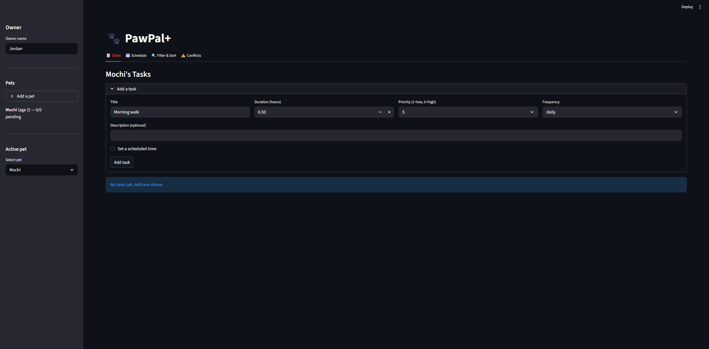

# PawPal+ (Module 2 Project)

PawPal+ is a pet care scheduling tool implemented in Python, designed as a Streamlit app (entrypoint in `app.py`).
It helps pet owners manage pets, tasks, and daily schedule generation with priority handling.

<a href="final_app.png" target="_blank"></a>.

## ✅ Implemented features

### Core domain objects (`pawpal_system.py`)
- `Owner` with:
  - `id: UUID`, `name: str`, `pets: List[Pet]`
  - `add_pet(pet: Pet)`
  - `get_pet(pet_id: UUID) -> Optional[Pet]`
  - `find_pet_by_name(pet_name: str) -> Optional[Pet]`
- `Pet` with:
  - `id: UUID`, `name: str`, `age: int`, `tasks: List[Task]`
  - `assign_task(task: Task)`
  - `get_task(task_id: UUID) -> Optional[Task]`
  - `complete_task(task_id: UUID) -> bool`
  - `uncomplete_task(task_id: UUID) -> bool`
  - `remove_task(task_id: UUID) -> bool`
- `Task` with:
  - `id: UUID`, `name: str`, `description: str`, `duration: float`, `priority: int`, `complete: bool`
  - `mark_complete()` / `mark_incomplete()`
  - `update(...)`
- `Schedule` with:
  - `day: date`, `task_list: List[Task]`
  - `add_task(task: Task)`
  - `remove_task(task_id: UUID) -> bool`
  - `generate() -> List[Task]` (priority-based sorting)
  - `clear()`

### Task operations
- Add/remove tasks by UUID for deterministic behavior (no duplicate name ambiguity)
- Mark tasks complete/uncomplete
- Update task details (name, description, duration, priority)

### Schedule generation
- Sort by uncompleted tasks first, then highest priority, then shorter duration
- Provides a simple base plan for a given day

## 📁 Project structure
- `app.py` - Streamlit UI + interaction layer
- `pawpal_system.py` - domain + scheduler logic
- `reflection.md` - design reflection and notes
- `requirements.txt` - dependencies

## 🚀 Quickstart

1. Create venv and install:

```bash
python -m venv .venv
.venv\Scripts\activate   # Windows
pip install -r requirements.txt
```

2. Run app:

```bash
streamlit run app.py
```

## 🧪 Testing
- Add tests (e.g., `test_pawpal_system.py`) for:
  - task lifecycle (add, complete, uncomplete, remove)
  - schedule generation and ordering
  - owner/pet lookups

## 🛠️ Future enhancements
- UI forms for task editing and deletion
- persistence layer (JSON/SQLite)
- constraints like maximum time block, availability windows
- explanation text for why schedule order was chosen
- multi-pet combined day planning

